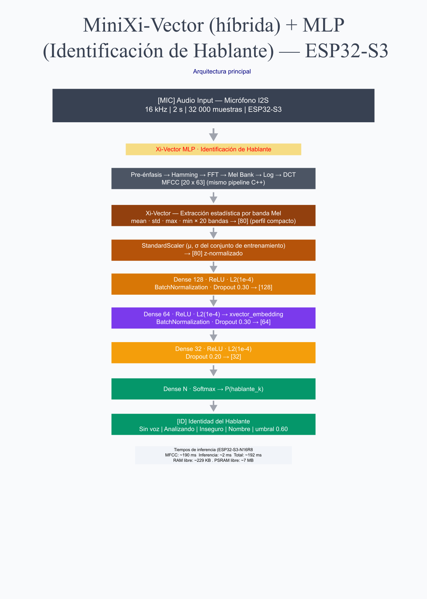

# MiniXi SpeakerID - ESP32-S3

Sistema embebido de identificación de hablantes en tiempo real usando ESP32-S3 N16R8 con PSRAM, micrófono I2S, MFCC, Mini Xi-vector híbrido, un clasificador MLP y TensorFlow Lite Micro.

El objetivo es capturar audio directamente desde el microcontrolador, transformar la voz en características compactas y clasificar quién está hablando sin depender de una computadora durante la inferencia.

## Arquitectura General

El sistema está dividido en dos partes:

1. Entrenamiento en Python: toma audios WAV organizados por hablante, extrae MFCC, resume cada segmento como Mini Xi-vector, entrena un MLP y exporta un modelo TFLite INT8.
2. Inferencia en ESP32-S3: captura audio por I2S, aplica VAD, calcula MFCC, genera el Mini Xi-vector, normaliza las 80 características y ejecuta el modelo con TensorFlow Lite Micro.

```text
Audio WAV / Micrófono I2S
-> audio 16 kHz, 2 s, 32 000 muestras
-> VAD
-> MFCC [20 x 63]
-> Mini Xi-vector [80]
-> normalización con media y desviación del entrenamiento
-> MLP INT8
-> Softmax
-> hablante detectado
```



El diagrama resume correctamente la arquitectura conceptual: primero se reduce el audio a MFCC, después se extrae un perfil estadístico compacto de 80 valores y finalmente un MLP decide el hablante. La franja "Xi-Vector MLP" debe entenderse como el nombre del pipeline híbrido, no como una capa adicional. Los valores de Dropout mostrados en la imagen (`0.30`, `0.30` y `0.20`) coinciden con la arquitectura entrenada.

## Qué Es Un Mini Xi-vector Híbrido

En este proyecto, el Mini Xi-vector no es un x-vector clásico de sistemas grandes de reconocimiento de hablantes. Es una versión compacta para microcontrolador.

Primero se calcula una matriz MFCC de `20 x 63`: 20 bandas acústicas durante 63 frames centrales de una ventana de audio de 2 segundos. Luego, por cada banda Mel, se calculan cuatro estadísticas:

- media
- desviación estándar
- valor máximo
- valor mínimo

El resultado es:

```text
20 bandas Mel x 4 estadísticas = 80 características
```

Se le llama híbrido porque combina dos enfoques:

- Procesamiento de señales: VAD, preénfasis, ventana Hamming, FFT, filtros Mel, log y DCT.
- Aprendizaje automático: un MLP aprende a clasificar el hablante a partir del vector estadístico normalizado.

Esto evita alimentar la red con las `32 000` muestras crudas de audio o con los `1 260` valores completos de MFCC. El ESP32-S3 solo entrega al modelo un vector de 80 características, reduciendo memoria, cómputo y tamaño del modelo.

## Dataset

El dataset de entrenamiento se organiza en `dataset_fam/`, con una carpeta por persona. En la versión actual se entrenan 4 clases:

- `hija`
- `hijo`
- `mama`
- `papa`

Cada persona tiene 8 grabaciones WAV:

- 5 grabaciones de preguntas naturales tomadas de `preguntas.txt`: saludo, últimas vacaciones, gustos, molestia de la semana y rutina del día.
- 3 grabaciones adicionales de situaciones de discusión, pensadas para capturar variaciones de voz con más tensión, cambios de tono, pausas y emoción.

Ese diseño busca que el modelo no memorice una sola frase. Las primeras cinco grabaciones dan voz cotidiana y cómoda; las tres de discusión agregan expresividad y variación emocional.

El dataset final usado para este modelo es la versión limpia de identificación de hablantes: no se hizo mezcla con ruido, no se generaron variantes por SNR y no existe una clase `ruido`. Las únicas clases entrenadas son personas reales.

Según `Train/procesamiento_log.txt`, el dataset procesado generó:

| Clase | Segmentos |
| --- | ---: |
| `hija` | 294 |
| `hijo` | 292 |
| `mama` | 295 |
| `papa` | 295 |
| Total | 1176 |

Cada segmento se representa como un vector de 80 características.

## Flujo Principal

1. Grabar 8 audios por persona.
2. Organizar el dataset en carpetas por hablante.
3. Procesar audios en Python.
4. Extraer MFCC.
5. Convertir MFCC a Mini Xi-vector de 80 características.
6. Normalizar con media y desviación del entrenamiento.
7. Entrenar un modelo MLP.
8. Exportar a TensorFlow Lite INT8.
9. Integrar el modelo en firmware.
10. Capturar audio en vivo por I2S.
11. Ejecutar inferencia en ESP32-S3.
12. Promediar predicciones recientes y mostrar el hablante detectado.

## Archivos Importantes

- `PIPELINE_V2_PROFESIONAL.md`: documento principal y actualizado del pipeline actual.
- `DOCUMENTACION_PROCESO_TRAIN.md`: documentación complementaria del procesamiento y entrenamiento.
- `preguntas.txt`: preguntas base para las 5 grabaciones naturales por persona.
- `Train/procesamiento_log.txt`: evidencia del dataset procesado, clases, segmentos y métricas.
- `Train/generate_speaker_labels.py`: genera `src/speaker_labels.h` desde `Train/labels.npy`.
- `src/main.cpp`: flujo principal del firmware.
- `src/MFCC.cpp` y `src/MFCC.h`: extracción MFCC en ESP32.
- `src/SpeakerNetwork.cpp` y `src/SpeakerNetwork.h`: manejo del modelo TensorFlow Lite Micro.
- `src/modelo_hablante.h`: modelo convertido a arreglo C.
- `src/normalizacion.h`: medias y desviaciones usadas para normalizar el Mini Xi-vector.
- `src/speaker_labels.h`: nombres de hablantes en el mismo orden que la salida del modelo.

## Resultados Actuales

El entrenamiento actual reporta:

| Métrica | Valor |
| --- | --- |
| Clases | 4 |
| Segmentos procesados | 1176 |
| Características por segmento | 80 |
| Parámetros del modelo | 21 604 |
| Accuracy de validación | 0.9831 |
| Accuracy del reporte final | 0.98 sobre 236 muestras |

## Documentación Principal

- **[Pipeline V2 profesional](PIPELINE_V2_PROFESIONAL.md)**: documento principal del proyecto.
- [Documentación del proceso de entrenamiento](DOCUMENTACION_PROCESO_TRAIN.md): detalle complementario del notebook y los archivos generados.
- [Preguntas de grabación](preguntas.txt): guía para las 5 grabaciones naturales por persona.
